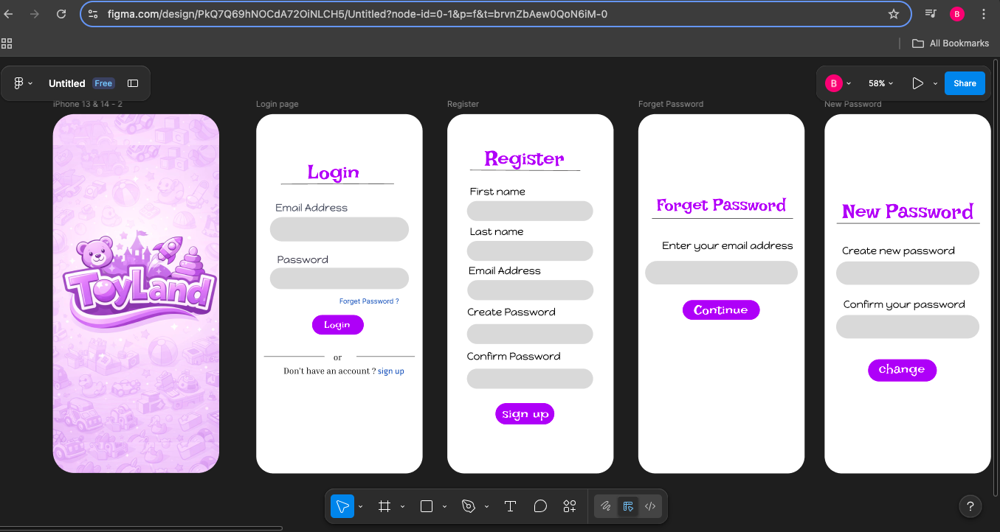
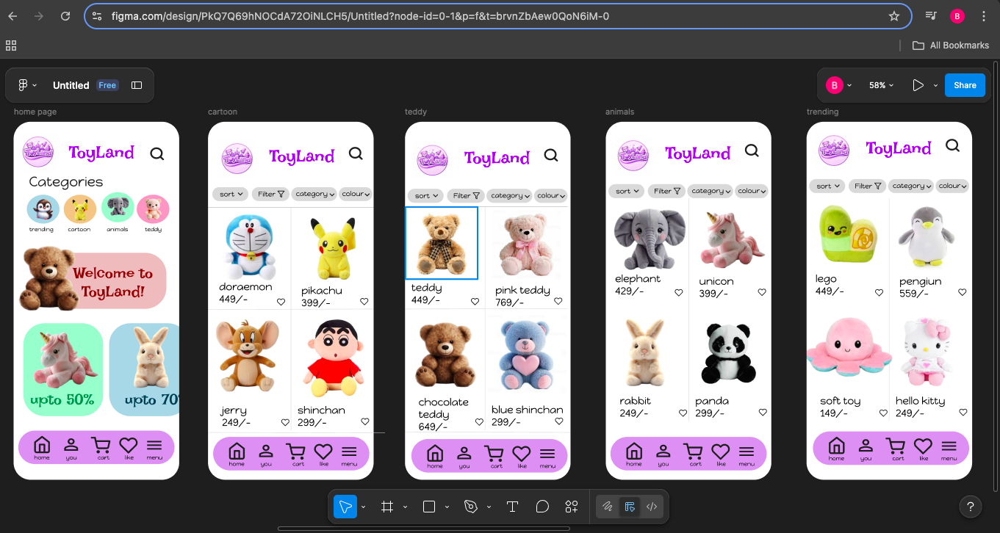
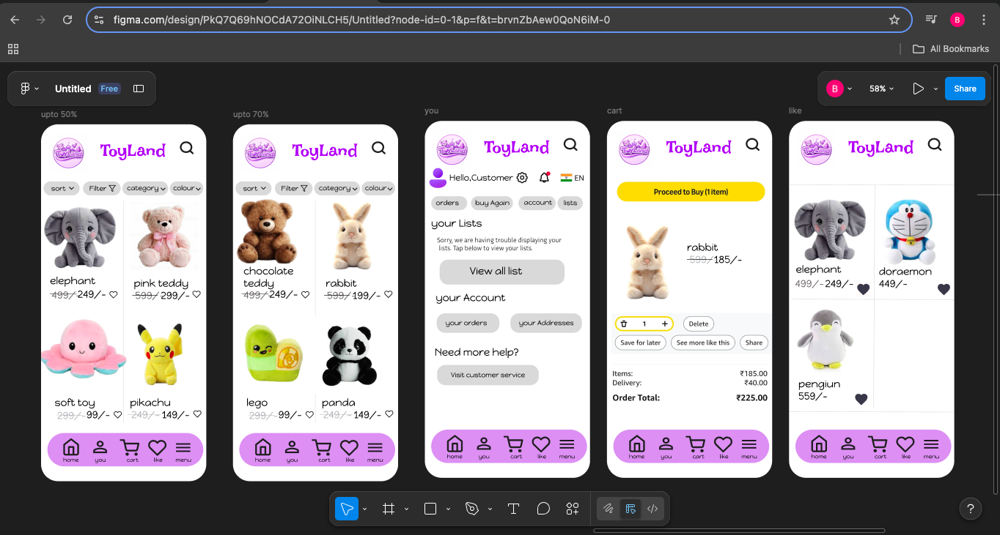

# 🧸 Toy Store Mobile App UI

## 📌 Description
This project is a mobile application UI design for a Toy Store created using Figma. It focuses on clean design, user-friendly navigation, and modern UI principles.

## 🚀 Features
- Login & Registration screens  
- Home page with categories  
- Product listing  
- Cart functionality  

## 🛠 Tools Used
- Figma  

## 🖼 Screenshots

## 🎯 Objective
To design a user-friendly and visually appealing toy store mobile app interface.
